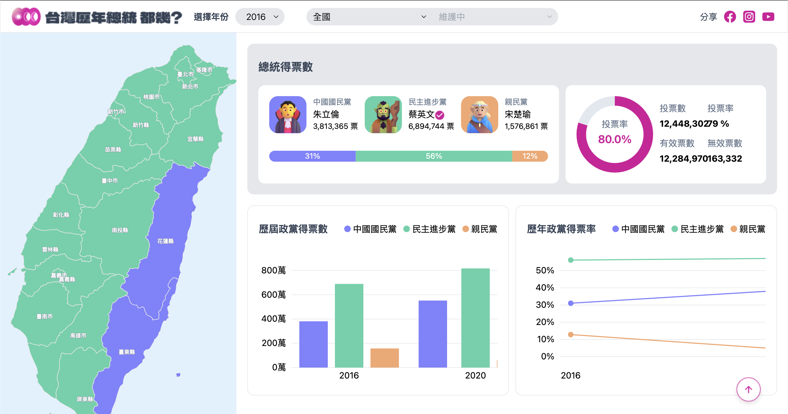

<div align="center">
 <br />
    <a href="https://rejennylo.github.io/theF2E2023/" target="_blank">
      
    </a>
  <br />

  <h3 align="center">總統開票網</h3>
</div>

## <a name="table">Table of Contents</a>

1. [Introduction](#introduction)
2. [Tech Stack](#tech-stack)
3. [Features](#features)
4. [Quick Start](#quick-start)

## <a name="introduction">Introduction</a>

總統開票資料查詢，使用者可透過下拉選單或點擊地圖來依據年份、地區查詢歷年選舉資料。

## <a name="tech-stack">Tech Stack</a>

- JavaScript
- React.js
- TailwindCSS
- D3.js
- React Router Dom

## <a name="features">Features</a>

- 透過 React 管理 D3 圖表的 DOM 更新
- 使用 D3 繪製線圖、長條圖、圓餅圖
- 解析 topoJSON 轉 geoJSON 並由 D3 繪製地圖
- 使用 React Hooks 進行渲染狀態管理
- 使用 React Router Dom 設置前端路由

## <a name="quick-start">Quick Start</a>

請按照下方的步驟執行

**Cloning the Repository**

```bash
git clone https://github.com/your-username/your-project.git
cd your-project
```

**Installation**

使用 npm 安裝依賴項：

```bash
npm install
```

**Running the Project**

```bash
npm start
```

在瀏覽器中輸入 [http://localhost:3000](http://localhost:3000) 查看本機項目